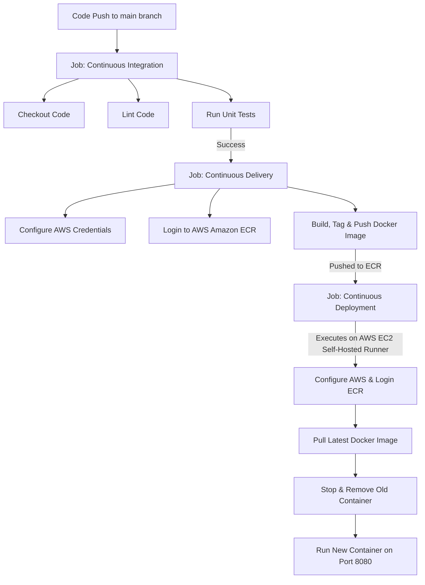

# 🚀 CI/CD Pipeline Implementation

This project implements a fully automated Continuous Integration, Continuous Delivery, and Continuous Deployment (CI/CD) pipeline using **GitHub Actions**, **Docker**, and **AWS (Amazon ECR & EC2 self-hosted runner)**. 

The configurations are defined in [main.yaml](file:///home/logan78/efforts/projects/completed/end_to_End/.github/workflows/main.yaml).

---

## 📐 Architecture & Workflow Diagram

---

## 🛠️ Pipeline Stages

### 1. Continuous Integration (CI)
Runs on `ubuntu-latest`. It performs validation blocks when changes are pushed:
- **Lint Code**: Checks syntax and style requirements.
- **Run Unit Tests**: Executes unit test suites to guarantee code integrity.

### 2. Continuous Delivery (CD)
Runs on `ubuntu-latest` and depends on the success of the CI stage. It handles containerizing the application:
- **Builds the Docker container** using the project's root [Dockerfile](file:///home/logan78/efforts/projects/completed/end_to_End/Dockerfile).
- **Authenticates to AWS** and logs in to the Amazon Elastic Container Registry (ECR).
- **Tags the image** as `latest` and pushes the artifact securely to ECR.

### 3. Continuous Deployment (CD)
Runs on an AWS EC2 instance running a **GitHub Actions Self-Hosted Runner**.
- **Pulls the latest image** from AWS ECR.
- **Gracefully stops and removes** the active running container (if any) named `cnncls` to avoid port conflict.
- **Runs the new Docker image** in detached mode on port `8080`.
- Passes AWS credentials as environment parameters to allow the containerized application to pull data/interact with AWS environments when running.
- **Prunes the Docker system** to clean up cache, dangling layers, and stop logs from taking over disk space.

---

## 🔐 Setup and Prerequisites

To deploy this workflow on your own AWS structure, follow these setup steps:

### A. AWS Setup
1. **Amazon ECR**: Create an ECR repository. Save the Registry URL and repository name.
2. **Amazon EC2**: Spawn an EC2 instance (e.g. t2.medium or larger depending on model sizes).
3. **GitHub Self-Hosted Runner**:
   - Go to your GitHub Repository -> Settings -> Actions -> Runners.
   - Click "New self-hosted runner" and follow the instructions to install and start the runner agent on your EC2 instance.
4. **Install Docker**: Install Docker on the EC2 instance, and make sure the runner user is added to the `docker` group (`sudo usermod -aG docker github-runner` or similar).

### B. Configuration of GitHub Secrets
Add the following secrets under **Settings > Secrets and variables > Actions** in your GitHub repository:

| Secret Name | Description |
| :--- | :--- |
| `AWS_ACCESS_KEY_ID` | AWS IAM User access key with ECR push/pull permissions |
| `AWS_SECRET_ACCESS_KEY`| AWS IAM User secret key matching the ID |
| `AWS_REGION` | The region of your ECR repository (e.g., `us-east-1`) |
| `AWS_ECR_LOGIN_URI` | ECR Registry URI (e.g., `123456789012.dkr.ecr.us-east-1.amazonaws.com`) |
| `ECR_REPOSITORY_NAME` | The name of your custom built ECR repository |
